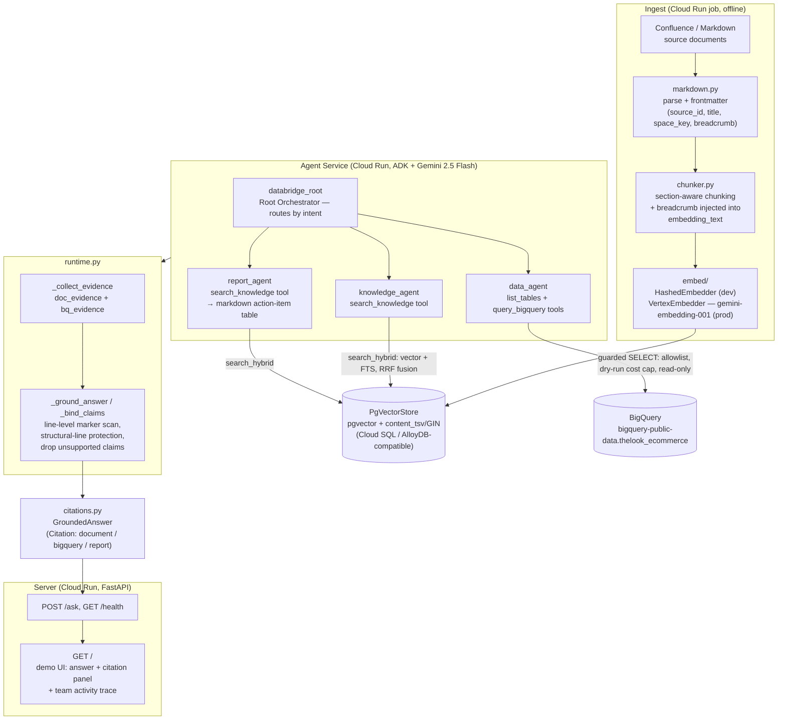

# Data Bridge v0.2.0 — Development Completion Report

> Status: **Complete**, merged to `main` ([PR #1](https://github.com/ParkHwan/Data-Bridge/pull/1)).
> Scope: architecture Phase 1 + Phase 2 (see [architecture.md](../design/architecture.md))
> plus the Phase 2.5 quality-hardening pass (see
> [phase-quality-hardening.md](../design/phase-quality-hardening.md)).

## 1. What shipped in v0.2.0

| Phase | Capability | Status |
|---|---|---|
| Phase 1 | Confluence-style Markdown ingest → chunk (breadcrumb-aware) → embed → pgvector store | ✅ |
| Phase 1 | Knowledge Agent — document Q&A with mandatory citations | ✅ |
| Phase 1 | Citation contract (`document` / `bigquery` / `report`), 5-question mini golden set | ✅ |
| Phase 2 | Data Agent — BigQuery NL2SQL with guardrails (allowlist, dry-run cost cap, read-only) | ✅ |
| Phase 2 | Report Agent — action-item tables with per-row citations | ✅ |
| Phase 2 | ADK Root Orchestrator routing across all three specialists + collaboration trace | ✅ |
| Phase 2 | FastAPI service + demo UI (answer, citation panel, team activity trace) | ✅ |
| **Phase 2.5 (new this release)** | **RRF hybrid search** — vector + PostgreSQL FTS fusion, replacing vector-only retrieval | ✅ |
| **Phase 2.5 (new this release)** | **Claim-level citation verification** — per-line/per-table-row marker binding; unsupported lines are dropped, not merely flagged | ✅ |

Everything above was verified against a **live** Gemini 2.5 Flash + Vertex
`gemini-embedding-001` run, not only offline tests: `keyword_hit=1.000`,
`source_hit=5/5` on the mini golden set, no regression from the v0.1.0 baseline.
Korean-language question/answer round trips were also verified live across all three
agents (Knowledge, Report, Data) — see conversation history; cross-lingual retrieval
works because the embedding model is multilingual, and the per-line (not
per-sentence) claim-binding design was chosen specifically to be script-agnostic.

## 2. Architecture



## 3. Data flow — a single question, end to end

```mermaid
sequenceDiagram
    actor User
    participant UI as Demo UI
    participant API as FastAPI /ask
    participant Root as databridge_root
    participant KA as knowledge_agent
    participant Store as PgVectorStore
    participant LLM as Gemini 2.5 Flash
    participant RT as runtime._bind_claims

    User->>UI: asks a question
    UI->>API: POST /ask {question}
    API->>Root: ask_async(question)
    Root->>Root: classify intent, route
    Root->>KA: transfer (knowledge question)
    KA->>Store: search_hybrid(embedding, query_text)
    Note over Store: vector candidates (cosine)<br/>+ FTS candidates (websearch_to_tsquery)<br/>fused via RRF (score = 1/(k+rank))
    Store-->>KA: top-k ranked chunks (ref 1..N)
    KA->>LLM: generate answer, cite refs used
    LLM-->>KA: text, one claim per line,<br/>trailing [n] marker(s) per line
    KA-->>Root: function_response (search_knowledge result)
    Root-->>API: streamed events (tool calls/results + final text)
    API->>RT: _ground_answer(final_text, doc_evidence, bq_evidence)
    Note over RT: scan each line for [n] markers<br/>(finditer, not just line-end)<br/>keep line if any ref resolves,<br/>drop it otherwise;<br/>strip all marker spans + tidy whitespace
    RT-->>API: GroundedAnswer{answer, citations} + dropped_claims
    API-->>UI: {answer, citations[], trace[]}
    UI-->>User: answer + citation panel + collaboration trace
```

## 4. Quality gates (this release)

```
uv run pytest -q        → 47 passed
uv run ruff check .     → all checks passed
uv run mypy             → no issues (19 source files)

Live golden set (scripts/run_golden.py, real Gemini + Vertex embeddings):
  keyword_hit = 1.000
  source_hit  = 5/5
```

## 5. Development process (Phase 2.5)

The RRF hybrid search and claim-level citation verification features were designed and
implemented through a 4-round, 3-party review loop — Claude (design + integration),
Antigravity (independent design/code review), Codex (implementation) — documented in
full in [phase-quality-hardening.md](../design/phase-quality-hardening.md) §6–7,
including every bug found and fixed along the way:

- A `keep_unmarked` guard that over-permissively disabled claim-dropping on any
  BigQuery-adjacent response, not only true BigQuery-only ones.
- A structural-line exemption that (over-)corrected into letting unmarked bullet/quote
  lines bypass citation checking entirely.
- A trailing-marker regex that failed on the more conventional `"claim [1]."`
  punctuation ordering.
- A live-Gemini-only-reproducible bug where multiple claims sharing one physical line
  left earlier `[n]` markers visible as leftover text in the final answer, found only
  after running the live golden set (not caught by any offline unit test) — fixed and
  re-verified live.

## 6. Known limitations (carried forward, intentionally out of scope)

- Postgres FTS uses the `'english'` text-search configuration — no Korean stemming.
  Live testing confirms Korean Q&A still works end-to-end because the vector/embedding
  side is multilingual; keyword-only recall for Korean terms is weaker than for English.
  **→ Addressed in [v0.2.1](v0.2.1.md): a `pg_trgm` trigram source is fused as a third RRF
  signal, recovering Korean keyword recall without breaking the D-3 portable profile.**
- A single line containing more than one claim with *different* refs binds all of them
  correctly (fixed this release), but per-claim attribution within that line is not
  separately verified — accepted, not fixed (see design doc §7.2).
- A table with a multi-line/captioned header (more than one line above `|---|`) only
  protects the single line immediately above the separator.
- True semantic support-verification (does the cited chunk *actually* substantiate the
  specific claim, beyond "a marker naming a real ref exists") is not implemented —
  explicitly deferred, would need an LLM-judge pass.
- `scripts/run_golden.py` requires live GCP/Vertex AI credentials and cannot run in an
  automated/sandboxed CI-less environment; it remains an owner-run manual gate.

## 7. GCP stack (unchanged from v0.1.0)

| Component | Service |
|---|---|
| LLM / embeddings | Vertex AI — Gemini 2.5 Flash / gemini-embedding-001 |
| Agent framework | ADK (root + 3 specialists) |
| Vector store | Cloud SQL for PostgreSQL + pgvector (AlloyDB-compatible) |
| Structured data | BigQuery (public dataset `thelook_ecommerce`) |
| Deploy | Cloud Run (service + ingest job, scale-to-zero) |

## 8. References

- [Architecture design v0.1](../design/architecture.md) — original Phase 1–3 plan and
  3-party design review log.
- [Phase 2.5 quality-hardening design](../design/phase-quality-hardening.md) — full
  design, 4-round review log, and live-verification evidence for this release's new
  features.
- [PR #1](https://github.com/ParkHwan/Data-Bridge/pull/1) — the merged change set.
